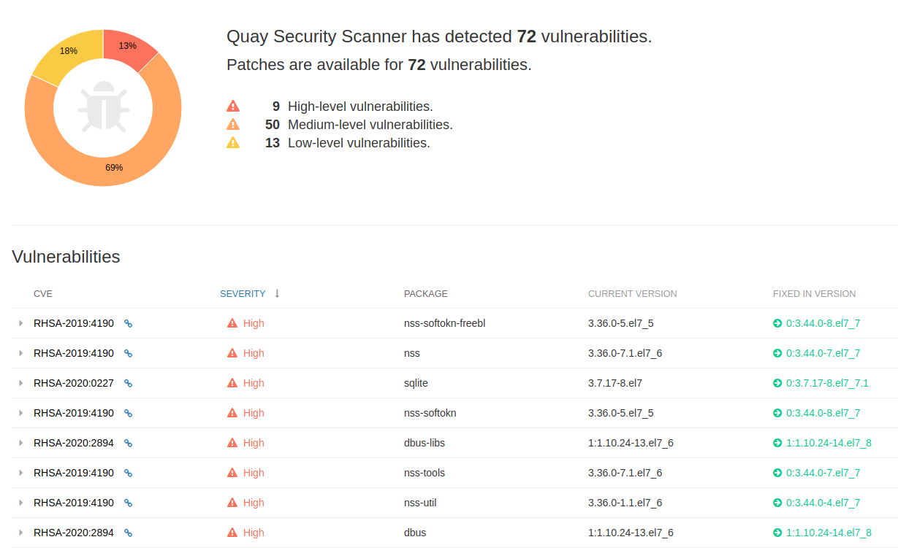

# Practice: Exploring Red Hat Quay.io

1. create a free account on [quay.io](https://quay.io/signin/)

.png>)

2\. Modify your myhttpd Dockerfile with the below content

```
FROM registry.access.redhat.com/ubi7/ubi:7.6

RUN yum -y install httpd php php-mysql \
&& rm -rf /var/cache/yum/* \
&& yum clean all

ENV PORT 8080
RUN sed -i 's/^Listen 80/Listen ${PORT}/g' /etc/httpd/conf/httpd.conf

ADD https://www.adminer.org/latest-mysql-en.php /var/www/html/index.php

RUN chown -R apache /var/log/httpd /run/httpd 

EXPOSE ${PORT}


CMD ["/usr/sbin/apachectl", "-DFOREGROUND"]

```

3\. use podman build to build the image

```
[root@servera myhttpd]# podman build -t myhttpd .
STEP 1: FROM registry.access.redhat.com/ubi7/ubi:7.6
..
..
..
STEP 2: RUN yum -y install httpd php php-mysql && rm -rf /var/cache/yum/* && yum clean all
..
..
..
STEP 3: ENV PORT 8080
5b8eefe8333c7baf4cae9d74cebba30f07cda6decb1afba16e047ac52837633d
STEP 4: RUN sed -i 's/^Listen 80/Listen ${PORT}/g' /etc/httpd/conf/httpd.conf
c33dd498e1ae2489b5364d09d1b83683b961e9ff66dfe581d9a81597dd84dcf4
STEP 5: ADD https://www.adminer.org/latest-mysql-en.php /var/www/html/index.php
ba85a7d43de1972d0fabc38d41086ec5da2df1baefc11125182e391005499f4c
STEP 6: RUN chown -R apache /var/log/httpd /run/httpd 
005ebe39e50895fdf23d0bf8294857411046b46b092b6ea561ddc1bdadb640d7
STEP 7: EXPOSE ${PORT}
8135bdd29414066f427f0dfbd25c4f93f976464147c1954e9afe2fd5636e4870
STEP 8: CMD ["/usr/sbin/apachectl", "-DFOREGROUND"]
STEP 9: COMMIT myhttpd
18840b4f6bbd65f89ff7f3302f3f2984ed0980caf0a35464827f590020128b9a
18840b4f6bbd65f89ff7f3302f3f2984ed0980caf0a35464827f590020128b9a

```

4\. tag this newly created image to be ready to push to quay.io

```
podman tag myhttpd quay.io/yourquayaccount/myhttpd
```

5\. login to quay using podman login

```
[root@servera ~]# podman login quay.io
Username: yourquayaccount
Password: yourpassword
Login Succeeded!
[root@servera ~]# 

```

6\. push the image using podman push command

```
[root@servera ~]# podman push quay.io/yourquayaccount/myhttpd
Getting image source signatures
Copying blob f445747e994d done  
Copying blob 1758474372b2 done  
Copying blob 824bb58035ef done  
Copying blob cadc1369c318 done  
Copying blob 1c80afac2adc done  
Copying blob 917b65ce8d46 done  
Copying config 18840b4f6b done  
Writing manifest to image destination
Copying config 18840b4f6b [--------------------------------------] 0.0b / 3.4KiB
Writing manifest to image destination
Storing signatures
[root@servera ~]# 
```

7\. view the new repository on quay.io and click on tags

.png>)

8\. Wait for the Security Scan to complete, this may take a while. Once done, click on the results to see details.&#x20;



as we have used an older image based on RHEL 7.6, it was very likely to see a lot of security issue.

9\. Rebuild the image with latest tag, and push it again with myhttpd:fixed tag

```
[root@servera myhttpd]# cat Dockerfile 
FROM registry.access.redhat.com/ubi7/ubi:latest

RUN yum -y install httpd php php-mysql \
&& rm -rf /var/cache/yum/* \
&& yum clean all

ENV PORT 8080
RUN sed -i 's/^Listen 80/Listen ${PORT}/g' /etc/httpd/conf/httpd.conf

ADD https://www.adminer.org/latest-mysql-en.php /var/www/html/index.php

RUN chown -R apache /var/log/httpd /run/httpd 

EXPOSE ${PORT}


CMD ["/usr/sbin/apachectl", "-DFOREGROUND"]


[root@servera myhttpd]# podman build -t myhttpd:fixed .

```

10\. tag the image again with your quay.io account and push it

```
podman tag myhttpd:fixed quay.io/yourquayaccount/myhttpd:fixed
```

```
podman push quay.io/jswapnil/myhttpd:fixed
```

11\. check tags again on quay.io and wait for the scan to complete.

.png>)

12\. You should see quite less or no security issues with this image

.png>)

_**Congratulations! this concludes the exercise.**_
