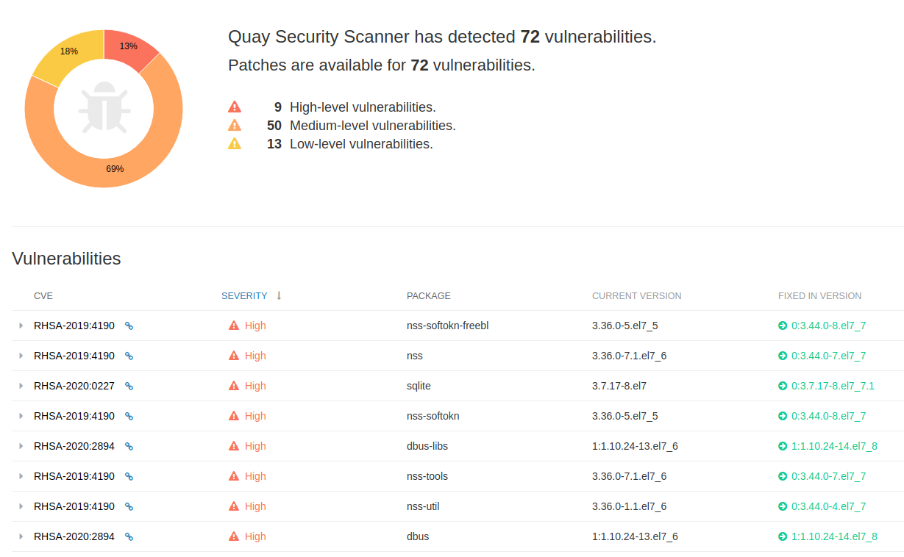

# Practice: Exploring Red Hat Quay.io

1. create a free account on [quay.io](https://quay.io/signin/)

.png>)

2\. Modify your myhttpd Containerfile with the below content

```
FROM registry.access.redhat.com/ubi9/ubi:latest

RUN dnf -y install httpd php php-mysqlnd \
&& rm -rf /var/cache/dnf/* \
&& dnf clean all

ENV PORT 8080
RUN sed -i 's/^Listen 80/Listen ${PORT}/g' /etc/httpd/conf/httpd.conf

ADD https://www.adminer.org/latest-mysql-en.php /var/www/html/index.php

RUN chown -R apache /var/log/httpd /run/httpd 

EXPOSE ${PORT}


CMD ["/usr/sbin/apachectl", "-DFOREGROUND"]

```

3\. use podman build to build the image

```
$ podman build -t myhttpd .
STEP 1/7: FROM registry.access.redhat.com/ubi9/ubi:latest
..
..
STEP 2/7: RUN dnf -y install httpd php php-mysqlnd && rm -rf /var/cache/dnf/* && dnf clean all
..
..
STEP 3/7: ENV PORT 8080
STEP 4/7: RUN sed -i 's/^Listen 80/Listen ${PORT}/g' /etc/httpd/conf/httpd.conf
STEP 5/7: ADD https://www.adminer.org/latest-mysql-en.php /var/www/html/index.php
STEP 6/7: RUN chown -R apache /var/log/httpd /run/httpd
STEP 7/7: EXPOSE ${PORT}
STEP 8/8: CMD ["/usr/sbin/apachectl", "-DFOREGROUND"]
COMMIT myhttpd
--> 18840b4f6bbd
18840b4f6bbd65f89ff7f3302f3f2984ed0980caf0a35464827f590020128b9a

```

4\. tag this newly created image to be ready to push to quay.io

```
podman tag myhttpd quay.io/yourquayaccount/myhttpd
```

5\. login to quay using podman login

```
$ podman login quay.io
Username: yourquayaccount
Password: yourpassword
Login Succeeded!

```

6\. push the image using podman push command

```
$ podman push quay.io/yourquayaccount/myhttpd
Getting image source signatures
Copying blob f445747e994d done   |
Copying blob 1758474372b2 done   |
Copying blob 824bb58035ef done   |
Copying blob cadc1369c318 done   |
Copying config 18840b4f6b done   |
Writing manifest to image destination
```

7\. view the new repository on quay.io and click on tags

.png>)

8\. Wait for the Security Scan to complete, this may take a while. Once done, click on the results to see details.&#x20;



9\. If there are security issues, rebuild the image ensuring the base image is up to date, tag and push it again with myhttpd:fixed tag

```
podman build --no-cache -t myhttpd:fixed .
```

10\. tag the image again with your quay.io account and push it

```
podman tag myhttpd:fixed quay.io/yourquayaccount/myhttpd:fixed
```

```
podman push quay.io/yourquayaccount/myhttpd:fixed
```

11\. check tags again on quay.io and wait for the scan to complete.

.png>)

12\. You should see fewer or no security issues with the updated image

.png>)

_**Congratulations! this concludes the exercise.**_
